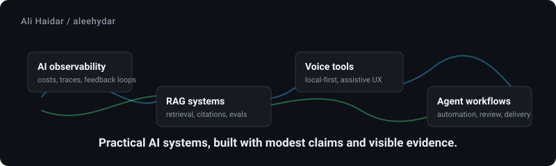

<div align="center">



# Ali Haidar

Applied AI & Machine Learning Engineer working with Python, C++, FastAPI, RAG, multi-agent systems, and MLOps.

[Pakistan Legal AI](https://github.com/aleehydar/Pakistan-Legal-AI) • [bizscout](https://github.com/aleehydar/bizscout) • [clinicflow](https://github.com/aleehydar/clinicflow)

</div>

---

## What I am building toward

I am learning by building practical AI systems: tools that can be run, tested, evaluated, and deployed. I am not trying to present myself as an expert; I am trying to build a body of work that gets more reliable over time.

My strongest current themes are:

- Agentic RAG systems with HyDE retrieval, CrossEncoder reranking, and self-consistency checks
- Multi-agent orchestrations with LangGraph evaluating market, regulatory, and financial constraints
- Parameter-efficient LLM fine-tuning (QLoRA 4-bit) for domain-specific structured generation
- Edge computer vision deployment and optimization (YOLO, ONNX, Raspberry Pi)
- Production MLOps pipelines with containerization, automated testing, and CI/CD gates

## Public projects

These are my own public repositories that are worth showing right now.

| Project | Focus | Stack |
| :--- | :--- | :--- |
| [Pakistan-Legal-AI](https://github.com/aleehydar/Pakistan-Legal-AI) | Agentic RAG for statutory law with HyDE retrieval, CrossEncoder reranking, and SSE streaming. | Python, FastAPI, FAISS, LangChain |
| [bizscout](https://github.com/aleehydar/bizscout) | Multi-agent market research and business intelligence platform evaluating venture feasibility. | Python, LangGraph, FastAPI, Docker |
| [clinicflow](https://github.com/aleehydar/clinicflow) | Fine-tuned open-source LLM for structured clinical SOAP note generation. | Python, PyTorch, QLoRA, Hugging Face |
| [Employee-Attrition-Predictor](https://github.com/aleehydar/Employee-Attrition-Predictor) | End-to-end MLOps pipeline with ONNX runtime inference and automated CI/CD deployment. | Python, scikit-learn, ONNX, Docker, GitHub Actions |
| [docgraph](https://github.com/aleehydar/docgraph) | General-purpose GraphRAG system with force-directed graph visualization. | Python, React, Neo4j, FAISS, FastAPI |

## Private case-study areas

Some active work is private while it is being shaped. I mention it as scope, not as public proof.

| Area | What I can discuss |
| :--- | :--- |
| Edge camouflage detection | Custom YOLO vision pipelines optimized for real-time edge processing on low-power devices. |
| Offline document processing | Air-gapped local ingestion, rule-based field extraction, and vector index generation for enterprise files. |
| Specialized scraper pipelines | Asynchronous scraping frameworks for unstructured web data extraction and semantic matching. |

*I would rather keep private work described honestly than make the profile look bigger than the evidence available to a visitor.*

## Stack

```text
Languages:  Python, C++, JavaScript, TypeScript, SQL
Backend:    FastAPI, Flask, REST APIs, SSE streaming, Async SQLAlchemy
AI/ML:      RAG, Agentic AI (LangGraph, LangChain), PyTorch, Hugging Face (QLoRA), YOLO, OpenCV
Data/Infra: FAISS, Qdrant, Pinecone, Neo4j, PostgreSQL, Docker, GitHub Actions, AWS EC2
